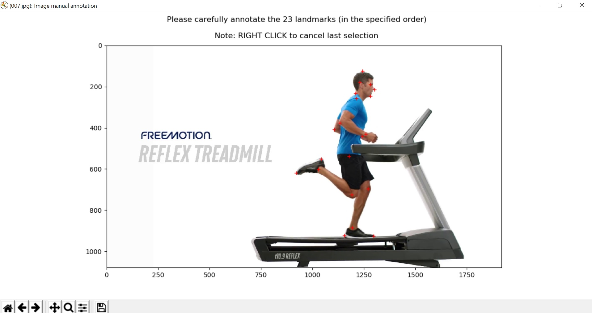

___

___

<em>For more information, visit <a href='http://www.dourthe.tech'>www.dourthe.tech</a></em>

# Computer vision projects (Python)

__
## Curv motion capture

#### Definition
This folder contains a computer vision algorithm written to allow the automated detection of body landmarks on 2D videos (i.e. marker-less motion capture).

#### Content
    
| Code | Definition  |
| ---- |-------------|
| img\_annotation.py | Allow the manual annotation of body landmarks by importing a data set of 2D images of people running (for validation of the automated algorithm) |

#### Example

Screenshot of the img_annotation code in use. Each red cross indicates a landmarks manually selected. The algorithm loops on the data set chosen and the correspoding 2D coordinates of each landmarks will then be saved and exported in a csv file.

