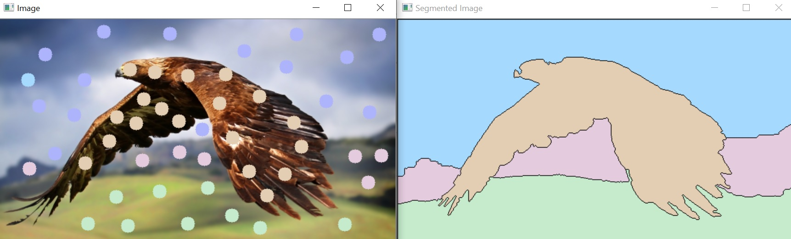
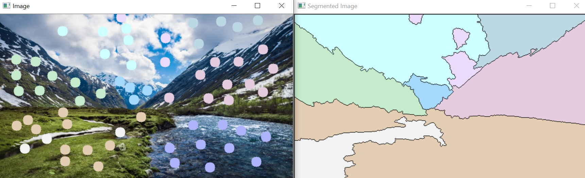
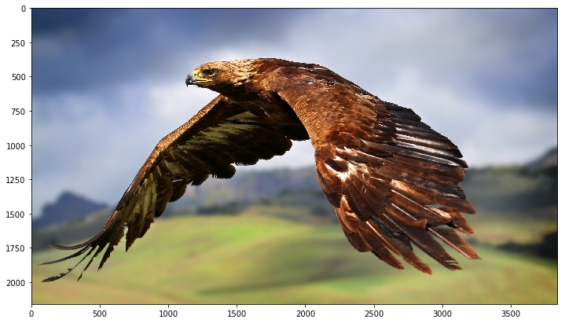

___

<a href='http://www.dourthe.tech'> </a>
___
<center><em>For more information, visit <a href='http://www.dourthe.tech'>www.dourthe.tech</a></em></center>

# Semi-Automated Image Segmentation using the Watershed Algorithm

___
## Objective
Build a function enabling the semi-automated segmentation of 2D images using the functionality of the Watershed Algorithm.

___
## Function preview
When running, the function will open two distinct windows:
* Image: a random image from the _data_ folder
* Segmented Image: an empty black window that will progressively display the segments resulting from the Watershed algorithm

In order to use the functionality of the Watershed algorithm, the user simply has to click on the _Image_ to define the location of markers. The user can decide to use a different marker by pressing the '+' key.

Note that each group/color of marker will define landmarks that the Watershed algorithm will use to define specific segments. In the end, their should be as many segments showing on the _Segmented Image_ as there are colors of markers on the main _Image_.

**Example 1**


**Example 2**


**Additional options**

* resize ratio: resize the imported image to allow the image to be seen in full on your screen
* cmap: choose a qualitative color palette from matplotlib
* reset: while function is running, press the 'r' key at anytime to reset the image and markers (will display a new random image from the _data_ folder)
* stop: while function is running, press the 'Esc' key at anytime to stop the execution of the code and close all windows

___
## Libraries Imports
### Data manipulation and analysis


```python
import os
import numpy as np
```

### Data visualization


```python
import matplotlib.pyplot as plt
from matplotlib import cm

%matplotlib inline
```

### Computer vision


```python
import cv2
```

___
## Data Import and Visualization
**We will create a list that contains the names of all files in the _data_ folder.**


```python
data = os.listdir('data')
```

Later on, we will build a function that selects a random image from the _data_ folder by selecting a random filename withint that list.

**Let's read and display the first image of the _data_ folder.**


```python
img = cv2.imread('data/' + data[0])
```

Note that using the _imshow_ method from the cv2 library require to open a separate window. In order to visualize the image within the notebook, we will use _imshow_ method from matplotlib instead.

However, since cv2 reads image with a Blue, Green, Red (BGR) color convention, we need to use the cvtColor method from cv2 to convert the color channels from BGR to Red, Green, Blue (RGB).


```python
plt.figure(figsize=(12,10))
plt.imshow(cv2.cvtColor(img, cv2.COLOR_BGR2RGB))
plt.show()
```





___
## Mouse Callback for Marker Selection
**Here, we will create a mouse callback function that allows the user the click on the image to select Watershed markers using the left click, and switch marker using the '+' key (which will also change the display color of the following markers).**

These markers are used to guide the Watershed algorithm, as each group/color of markers represent a group of pixels that belong to a defined sub-region of the image. The algorithm can then use that information to detect segments within the image.

_For more details on the Watershed algorithm, visit https://www.sciencedirect.com/topics/computer-science/watershed-segmentation_


```python
def mouse_callback(event, x, y, flags, param):
    
    global left_click
        
    if event == cv2.EVENT_LBUTTONDOWN:
        
        # Tracking for markers
        cv2.circle(marker_image, (x, y), 10, (color_idx), -1)
        
        # Display marker on image copy
        cv2.circle(img_copy, (x, y), 10, colors[color_idx], -1)
        
        # Set left_click to True
        left_click = True
```

___
## Colormap selection
To make sure that the function goes back to the first available color of the selected colormap when the user has passed all available colors, we will first create a dictionary that contains the names of all matplotlib qualitative colormaps as _keys_ and their respective number of colors as _values_.

_For more details on matplotlib colormaps, visit https://matplotlib.org/examples/color/colormaps_reference.html_


```python
cmap_length = {'Pastel1': 9, 'Pastel2': 8, 'Paired': 12, 'Accent': 8,
               'Dark2': 8, 'Set1': 9, 'Set2': 8, 'Set3': 12,
               'tab10': 10, 'tab20': 20, 'tab20b': 20, 'tab20c': 20}
```

**Select colormap.**


```python
cmap = 'Pastel1'
```

**Define total number of possible colors based on selected colormap length.**


```python
num_colors = cmap_length[cmap]
```

**Generate corresponding list of colors.**


```python
colors = []
for i in range(num_colors):
    # Generate RGB color code from current color index as a tuple
    exec('colors.append(tuple(np.array(cm.' + cmap + '(i))[:3]*255))')
```

___
## Watershed algorithm implementation


```python
# Import random image and resize it
rand_idx = np.random.randint(0, len(data))
img = cv2.imread('data/' + data[rand_idx])

# Create a copy of the image
img_copy = np.copy(img)

# Resize image (so both the original and segmented images can be seen in full on a single laptop screen)
resize = 1
if resize == 1:
    resize_ratio = 15 # percent of original size
    width = int(img.shape[1] * resize_ratio / 100)
    height = int(img.shape[0] * resize_ratio / 100)
    dim = (width, height)
    img = cv2.resize(img, dim, interpolation = cv2.INTER_AREA)
    img_copy = cv2.resize(img_copy, dim, interpolation = cv2.INTER_AREA)

# Generate empty segments image
segments = np.zeros(img_copy.shape, dtype=np.uint8)

# Initialize marker tracking so the Watershed algorithm knows what markers belong to a segment
marker_image = np.zeros(img_copy.shape[:2], dtype=np.int32)

# Initialize color index
color_idx = 0

# Initialize clicked booleen as False (will turn to True when left click, so the algorithm knows when to look for segments)
left_click = False

# Link mouse callback function to window
cv2.namedWindow('Image')
cv2.setMouseCallback('Image', mouse_callback)

while True:
    
    # Show the original image and the resulting Watershed segments in two separate windows
    cv2.imshow('Segmented Image', segments)
    cv2.imshow('Image', img_copy)        
        
    # Close everything if Esc is pressed
    k = cv2.waitKey(1)

    if k == 27:
        break
        
    # Reset everything if 'r' is pressed
    elif k == ord('r'):
        rand_idx = np.random.randint(0, len(data))
        img = cv2.imread('data/' + data[rand_idx])
        img_copy = img.copy()
        if resize == 1:
            img = cv2.resize(img, dim, interpolation = cv2.INTER_AREA)
            img_copy = cv2.resize(img_copy, dim, interpolation = cv2.INTER_AREA)
        marker_image = np.zeros(img_copy.shape[0:2], dtype=np.int32)
        segments = np.zeros(img_copy.shape, dtype=np.uint8)
        color_idx = 0
        left_click = False
        
    elif k == ord('+') and color_idx == cmap_length[cmap]-1:
        color_idx = 0
        
    elif k == ord('+'):
        color_idx += 1
           
    # Apply Watershed algorithm on our chosen markers when left clicked
    if left_click:
        
        marker_image_copy = marker_image.copy()
        cv2.watershed(img, marker_image_copy)
        
        segments = np.zeros(img_copy.shape, dtype=np.uint8)
        
        for color_ind in range(num_colors):
            segments[marker_image_copy == (color_ind)] = colors[color_ind]
        
        left_click = False
        
cv2.destroyAllWindows()
```
